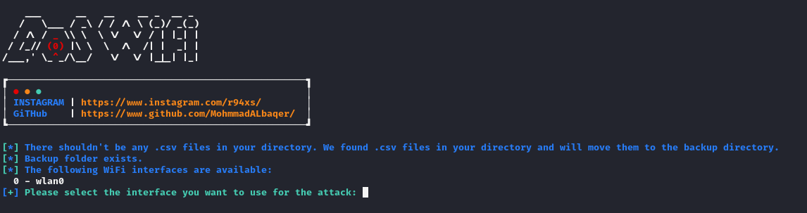
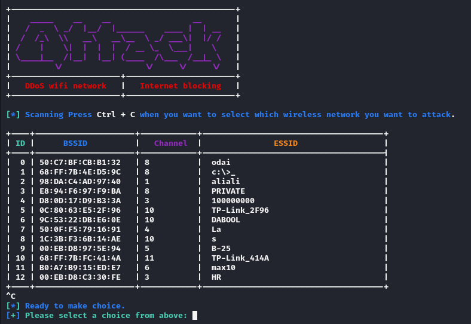

### Installation (Linux)

```
$ git clone https://github.com/MohmmadALbaqer/DoS_Wifi.git
$ cd DoS_Wifi
$ chmod +x *
$ sudo python3 DoS_Wifi
```
### Communication control
```
To restart the Internet after completing the attack type a command
$ sudo python3 control.py
```

### Requirements
```
usb wifi adapter
```



## [~] Find Me on :

- [](https://github.com/MohmmadALbaqer)


- [](https://instagram.com/r94xs)

